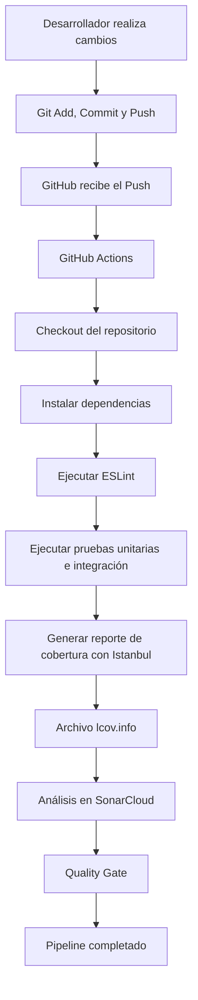
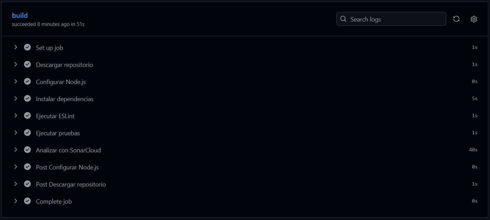
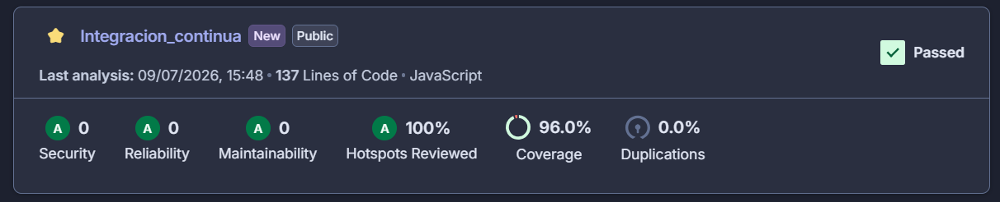

# Reporte de trabajo en Integración Continua (CI)

## Información general

**Proyecto:** Servicio API REST de Inventario

**Autor:** Tomas Ricaurte

**Tecnologías utilizadas:**

- Node.js
- Express.js
- Jest
- Supertest
- ESLint
- GitHub Actions
- SonarCloud
- Git y GitHub

## Objetivo del proyecto

Desarrollar un servicio web REST back-end siguiendo y aplicando buenas practicas en la construcción de software, pruebas automatizadas e integración continua.

EL proyecto implementa un CRUD basico de productos de manera organizada por capas (rutas, modelos, datos, controladores y servicios) e implementando pruebas unitarias, pruebas de integración, analisis estático del codigo y un pipeline automatizado gracias a GitHUb ACtions y SonarCloud.

## Arquitectura del proyecto

Integracion_continua/
│
├── .github/
│   └── workflows/
│       └── ci.yml
│
├── coverage/
│
├── src/
│   ├── controllers/
│   ├── data/
│   ├── middleware/
│   ├── models/
│   ├── routes/
│   ├── services/
│   ├── app.js
│   └── server.js
│
├── test/
│   ├── integracion/
│   └── unitarias/
│
├── sonar-project.properties
├── eslint.config.mjs
├── package.json
└── CI_REPORT.md

## Pipeline de Integración Continua


## Herramientas de calidad

### ESLint

Se configuró ESLint para verificar el cumplimiento de los estándares de codificación y poder detectar errores potenciales antes de ejecutar las pruebas.

### Jest

Se utilizó Jest para desarrollar las pruebas unitarias del proyecto.

### Supertest

Se empleó Supertest para validar el funcionamiento de los endpoints REST mediante pruebas de integración.

### Istanbul

La cobertura del código se obtuvo utilizando Istanbul integrado en Jest mediante el comando:

```bash
npm test -- --coverage
```

Los resultados se almacenaron en la carpeta `coverage/` y fueron utilizados por SonarCloud para calcular la cobertura del proyecto.

### SonarCloud

Se configuró SonarCloud para realizar análisis estático del código, detectar vulnerabilidades, medir mantenibilidad y visualizar la cobertura generada por Jest.


## Resultados obtenidos

### Pruebas automatizadas

Se desarrollaron pruebas unitarias para validar la lógica de negocio implementada en la capa de servicios y pruebas de integración para verificar el funcionamiento de los endpoints del servicio REST.

Las pruebas se ejecutan automáticamente mediante Jest cada vez que el pipeline de GitHub Actions detecta un nuevo *push* o una solicitud de *pull request*.

Resultados obtenidos:

- Total de pruebas ejecutadas: **22**
- Pruebas unitarias: **10**
- Pruebas de integración: **12**
- Pruebas exitosas: **22/22 (100%)**

---

### Cobertura del código

La cobertura del código fue generada utilizando **Istanbul**, integrado automáticamente con Jest mediante la opción `--coverage`.

Resultados de cobertura obtenidos mediante SonarCloud:

| Métrica | Resultado |
|---------|-----------:|
| Cobertura del código  | **96%** |
| Duplicación de código | **0%** |

El reporte detallado puede consultarse en:

```
coverage/lcov-report/index.html
```

---

### Análisis estático del código

Para garantizar la calidad del código se configuró **ESLint**, el cual se ejecuta automáticamente dentro del pipeline antes de las pruebas.

Durante el desarrollo se corrigieron todos los errores detectados por ESLint, obteniendo una ejecución satisfactoria sin advertencias que afectaran la calidad del proyecto.

---

### Resultados de SonarCloud

El proyecto fue integrado con SonarCloud para realizar análisis estático y verificar el cumplimiento de estándares de calidad.

Resultados obtenidos:

|         Indicador          | Resultado |
|----------------------------|:---------:|
| Quality Gate               | ✅ Passed |
| Security                   | A |
| Reliability                | A |
| Maintainability            | A |
| Cobertura                  | **96%** |
| Security Hotspots Reviewed | 100% |
| Duplicación                | 0% |

El análisis confirmó que el proyecto cumple satisfactoriamente los criterios mínimos de calidad establecidos para la actividad.

---

## Justificación del umbral de cobertura

En la actividad se estableció un umbral mínimo de cobertura del **80%**, ya que este valor permite garantizar que la mayor parte de la lógica del sistema se encuentra validada mediante pruebas automatizadas.

El proyecto superó ampliamente este requisito, alcanzando una cobertura del **96%**, lo que incrementa la confiabilidad del software y reduce la probabilidad de introducir errores durante futuras modificaciones.

---

## Evidencias

Las siguientes evidencias respaldan la correcta ejecución del pipeline:

- Captura del pipeline exitoso en GitHub Actions.

- Captura del análisis realizado por SonarCloud.

- Reporte HTML generado por Istanbul (`coverage/lcov-report/index.html`).

---

## Conclusiones

Durante el desarrollo de esta actividad se implementó un servicio REST utilizando Express.js, organizado mediante una arquitectura por capas que facilita el mantenimiento y la reutilización del código.

Se incorporaron pruebas unitarias y de integración utilizando Jest y Supertest, alcanzando una cobertura del **96%**, superando el mínimo solicitado.

Tambien se configuró un pipeline de Integración Continua mediante GitHub Actions, el cual automatiza la instalación de dependencias, la ejecución de ESLint, las pruebas automatizadas y el análisis de calidad con SonarCloud.

Finalmente, el proyecto obtuvo un **Quality Gate Passed**, demostrando que cumple con los estándares básicos de calidad, mantenibilidad y confiabilidad establecidos para el desarrollo de software moderno.